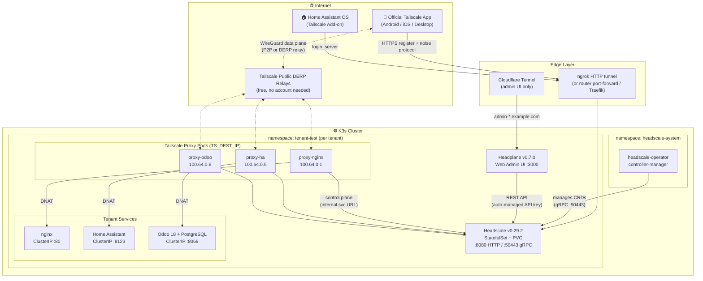
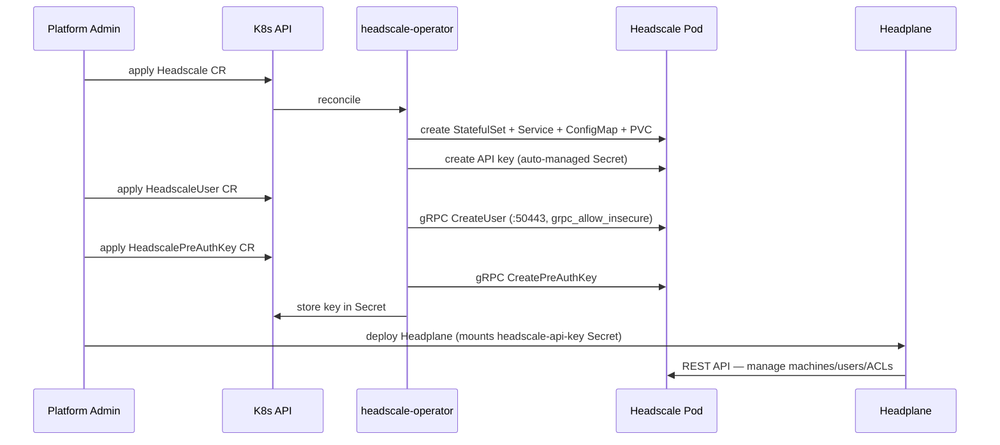
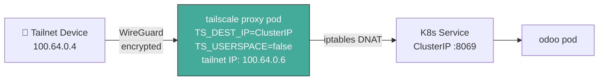
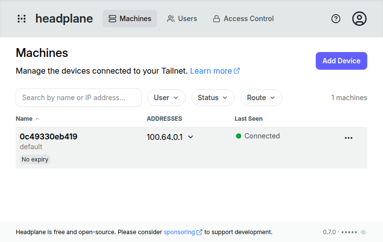

<h1 align="center">Woow VPN Headscale Package</h1>

<p align="center">
  <strong>Self-Hosted Multi-Tenant VPN Platform for K3s / Kubernetes</strong><br/>
  Headscale + Headplane + Tailscale Proxy Pods — compatible with the official Tailscale client
</p>

<p align="center">
  <a href="#overview">Overview</a> &bull;
  <a href="#architecture">Architecture</a> &bull;
  <a href="#installation">Installation</a> &bull;
  <a href="#components">Components</a> &bull;
  <a href="#screenshots">Screenshots</a> &bull;
  <a href="#external-access">External Access</a> &bull;
  <a href="#troubleshooting">Troubleshooting</a> &bull;
  <a href="README_zh-TW.md">中文文件</a>
</p>

<p align="center">
  
  
  
  
  
</p>

---

## Overview

**Woow VPN Headscale Package** is a production-tested deployment blueprint for running a **self-hosted, multi-tenant VPN platform** on K3s/Kubernetes. Every tenant gets an isolated [Headscale](https://github.com/juanfont/headscale) control plane (an open-source implementation of the Tailscale coordination server), a [Headplane](https://github.com/tale/headplane) web admin UI, and the ability to plug any in-cluster Kubernetes Service into their private tailnet via lightweight **Tailscale proxy pods**.

End-user devices connect with the **unmodified official Tailscale apps** (Android / iOS / Windows / macOS / Linux) — no custom clients required.

This repository was built and verified end-to-end on a live 10-node K3s cluster, including a real Android phone (Pixel 7a), a Home Assistant OS appliance, and three in-cluster services (Nginx, Home Assistant container, Odoo 18).

### Why This Package?

| Challenge | Solution |
|-----------|----------|
| SaaS VPNs (Tailscale/ZeroTier) put your coordination plane in someone else's cloud | Self-hosted Headscale — you own the control plane and the data |
| One shared tailnet for all customers is a security risk | **One Headscale instance per tenant** — hard isolation, no shared ACL file |
| Managing Headscale by hand (CLI, config files) doesn't scale | Declarative CRDs via [headscale-operator](https://github.com/infradohq/headscale-operator): `Headscale`, `HeadscaleUser`, `HeadscalePreAuthKey`, `HeadscaleAutoApprover` |
| Exposing a K8s service to a VPN usually means sidecar-per-pod hacks | Independent **tailscale proxy pod** per service — one service = one stable tailnet identity, no multi-replica identity chaos |
| Headscale has no built-in web UI | Headplane v0.7 — machines, users, ACLs in a browser |
| Cloudflare Tunnel silently breaks Tailscale clients | Documented root cause + verified working alternatives (see [External Access](#external-access)) |

---

## Architecture

### System Overview



### Tenant Provisioning Flow (Operator CRDs)



### Service-to-VPN Pattern (Proxy Pod)



> **Why a separate proxy pod instead of a sidecar?** A service scaled to N replicas with a Tailscale sidecar would register N different tailnet identities. A single independent proxy pod pointing at the Service ClusterIP keeps **one service = one stable tailnet identity**, while K8s load-balances behind the Service as usual. This mirrors Cloudflare's own recommendation for `cloudflared` deployments.

---

## Repository Structure

```
Woow_vpn_headscale_package/
├── README.md                     # This file
├── README_zh-TW.md               # Traditional Chinese documentation
├── manifests/
│   ├── tenant/                   # Per-tenant core stack
│   │   ├── 01-namespace.yaml         # Tenant namespace
│   │   ├── 02-headscale-cr.yaml      # Headscale CRD (v0.29.2, ACL, autoApprovers)
│   │   ├── 03-headscale-user.yaml    # Default user
│   │   ├── 05-headplane-secret.yaml  # Cookie secret (template)
│   │   ├── 06-headplane-configmap.yaml
│   │   ├── 07-headplane-deployment.yaml
│   │   ├── 08-cloudflared-config-patch.yaml  # CF Tunnel routes (admin UI only)
│   │   ├── 09-preauth-key.yaml       # Device PreAuthKey CRD
│   │   └── 10-auto-approver.yaml     # Route auto-approval notes
│   ├── services/                  # Demo workloads
│   │   ├── 11-test-nginx.yaml
│   │   ├── 20-ha-deploy.yaml         # Home Assistant container
│   │   └── 21-odoo-deploy.yaml       # Odoo 18 + PostgreSQL 16
│   └── vpn-proxy/                 # Service-to-VPN proxy pods
│       ├── 12-proxy-preauth-key.yaml
│       ├── 13-tailscale-proxy.yaml   # RBAC + proxy Deployment (nginx example)
│       └── 22-vpn-proxy-ha-odoo.yaml # HA + Odoo proxies
├── podman/                        # Single-node rootless Podman variant (no K8s)
│   ├── podman-compose.yml            # headscale + headplane services
│   ├── deploy.sh                     # one-shot automation (keys, health checks)
│   ├── .env.example
│   ├── README.md                     # Podman-specific guide
│   └── config/                       # headscale + headplane configs
├── scripts/
│   ├── deploy.sh                  # One-shot Phase 1-4 deployment (K8s)
│   └── add-service-to-vpn.sh      # Add any Service to the tailnet
└── docs/
    ├── DEPLOYMENT-REPORT.md       # Full deployment log with every issue + fix
    ├── EXTERNAL-ACCESS.md         # External connectivity options deep-dive
    ├── HAOS-ADDON-SETUP.md        # Home Assistant OS Tailscale add-on guide
    └── screenshots/               # UI screenshots
```

---

## Installation

### Prerequisites

- K3s / Kubernetes ≥ 1.25 with a default StorageClass
- Helm ≥ 3.8 (OCI registry support)
- `kubectl` access with cluster-admin

### Quick Start (Kubernetes)

```bash
git clone https://github.com/WOOWTECH/Woow_vpn_headscale_package.git
cd Woow_vpn_headscale_package
./scripts/deploy.sh
```

### Quick Start (Podman — single node, no K8s)

Verified on rootless Podman 4.9.3 + podman-compose 1.0.6:

```bash
cd podman
cp .env.example .env      # optionally set SERVER_URL
./deploy.sh
# Headscale: http://localhost:28080 · Headplane: http://localhost:23000/admin
```

See [`podman/README.md`](podman/README.md) for details, systemd boot persistence, and Podman-specific gotchas.

<p align="center"></p>

### Manual Steps

**Phase 1 — Operator**

```bash
kubectl create ns headscale-system
helm install headscale-operator \
  oci://ghcr.io/infradohq/headscale-operator/charts/headscale-operator \
  --version 0.5.0 -n headscale-system
# ⚠️ Chart version 0.5.0 = app v0.6.0 (chart and app versions differ!)

kubectl get crd | grep headscale
# headscales / headscaleusers / headscalepreauthkeys / headscaleautoapprovers
```

**Phase 2 — Tenant Headscale**

Edit `manifests/tenant/02-headscale-cr.yaml` (set your `server_url` and storage class), then:

```bash
kubectl apply -f manifests/tenant/01-namespace.yaml
kubectl apply -f manifests/tenant/02-headscale-cr.yaml
kubectl apply -f manifests/tenant/03-headscale-user.yaml
```

**Phase 3 — Headplane UI**

```bash
kubectl create secret generic headplane-secrets \
  --from-literal=COOKIE_SECRET="$(openssl rand -hex 16)" -n tenant-test
kubectl apply -f manifests/tenant/06-headplane-configmap.yaml
kubectl apply -f manifests/tenant/07-headplane-deployment.yaml
```

Login at the Headplane URL with the auto-managed API key:

```bash
kubectl get secret headscale-api-key -n tenant-test -o jsonpath='{.data.api-key}' | base64 -d
```

**Phase 4 — Connect a device**

```bash
kubectl apply -f manifests/tenant/09-preauth-key.yaml
KEY=$(kubectl get secret test-device-preauth-key -n tenant-test -o jsonpath='{.data.key}' | base64 -d)
# On the device:
tailscale up --login-server=https://<your-headscale-url> --authkey=$KEY
```

**Phase 5 — Add a service to the VPN**

```bash
./scripts/add-service-to-vpn.sh <service-name> <namespace> [tailnet-hostname]
# Example:
./scripts/add-service-to-vpn.sh odoo tenant-test odoo
```

---

## Components

| Component | Version | Image / Chart | Role |
|-----------|---------|---------------|------|
| headscale-operator | v0.6.0 (chart 0.5.0) | `oci://ghcr.io/infradohq/headscale-operator/charts/headscale-operator` | Declarative lifecycle for Headscale instances via CRDs |
| Headscale | v0.29.2 | `headscale/headscale:v0.29.2` | Per-tenant tailnet control plane (key exchange, ACL, node registry) |
| Headplane | v0.7.0 | `ghcr.io/tale/headplane:0.7.0` | Web admin UI (machines / users / ACLs) |
| Tailscale proxy | latest | `tailscale/tailscale:latest` | `TS_DEST_IP` DNAT proxy exposing K8s Services on the tailnet |
| DERP | — | Tailscale public relays | NAT-traversal fallback data plane (free, no account) |

### Verified Tailnet (Live Deployment)

| Node | Tailnet IP | Type | Status |
|------|-----------|------|--------|
| nginx-test | 100.64.0.1 | Proxy pod → nginx | ✅ online |
| Pixel 7a | 100.64.0.4 | Official Android app | ✅ registered |
| homeassistant | 100.64.0.5 | Proxy pod → HA container | ✅ online |
| odoo | 100.64.0.6 | Proxy pod → Odoo 18 | ✅ online |
| woowtechshowha | 100.64.0.7 | HAOS Tailscale add-on | ✅ online |

---

## Screenshots

### Headplane — Machines Overview
All tailnet nodes (proxy pods, phone, HAOS appliance) in one dashboard:

<p align="center"></p>

### Headplane — Machine Detail
Per-node view with tailnet IPs, connectivity, and route management:

<p align="center"></p>

### Headplane — API Key Login
Headplane authenticates against Headscale with the operator's auto-managed API key:

<p align="center"></p>

### Headplane — Users
Tenant user management:

<p align="center"></p>

### Headscale Control Plane — Health
`https://vpn-<tenant>.example.com/health` responding through the tunnel:

<p align="center"></p>

### Android — Custom Coordination Server
The official Tailscale app pointed at the self-hosted Headscale:

<p align="center"></p>

### Services Accessed Through the VPN

Home Assistant onboarding reached at `http://100.64.0.5:8123` and Odoo database manager at `http://100.64.0.6:8069` — both over the tailnet:

<p align="center">
  
  
</p>

---

## External Access

> **⚠️ Critical finding: Cloudflare Tunnel CANNOT proxy Headscale client traffic.**
> The Tailscale control protocol upgrades the HTTP connection with a **POST** request and a non-standard `Upgrade: tailscale-control-protocol` header. Cloudflare strips both ([cloudflared#883](https://github.com/cloudflare/cloudflared/issues/883), [cloudflared#990](https://github.com/cloudflare/cloudflared/issues/990)), and the [official Headscale docs](https://headscale.net/stable/ref/integration/reverse-proxy/) explicitly state it will not work. The Headplane **admin UI works fine** through Cloudflare — only the VPN control plane is affected.

Verified working options, in order of preference:

| Option | Cost | Stability | Notes |
|--------|------|-----------|-------|
| **Router port-forward + Traefik + Let's Encrypt** | Free | ⭐⭐⭐⭐⭐ | Best for production. DNS-only (grey cloud) Cloudflare record |
| **ngrok HTTP tunnel** | Free tier | ⭐⭐⭐ | ✅ **Tested & verified** — ngrok passes the noise protocol through. Free URL changes on restart, 1 GB/mo |
| **ngrok TCP tunnel** | Free tier | ⭐⭐⭐ | ✅ Tested — raw TCP passthrough, but random host/port = no valid TLS cert |
| Pinggy / bore.pub | $0–3/mo | ⭐⭐ | Raw TCP alternatives, same cert caveat |
| Cloudflare Tunnel | — | ❌ | **Does not work** for VPN clients (admin UI only) |

See [`docs/EXTERNAL-ACCESS.md`](docs/EXTERNAL-ACCESS.md) for the full analysis and setup guides.

---

## Configuration Highlights

### Headscale CR essentials (`manifests/tenant/02-headscale-cr.yaml`)

```yaml
spec:
  version: "v0.29.2"
  config:
    server_url: "https://vpn-test.example.com"   # public URL clients dial
    grpc_listen_addr: "0.0.0.0:50443"
    grpc_allow_insecure: true      # REQUIRED for operator (in-cluster gRPC)
    dns:
      magic_dns: true
      base_domain: "ts.example.com"  # MUST differ from server_url domain!
    policy:
      mode: database               # enables API-pushed ACL policy
  acl_policy:
    inline: |                      # autoApprovers work here (CRD is incompatible with v0.29)
      {
        "acls": [{"action": "accept", "src": ["*"], "dst": ["*:*"]}],
        "autoApprovers": {
          "routes": {"10.0.0.0/8": ["*"], "192.168.0.0/16": ["*"]},
          "exitNode": ["*"]
        }
      }
```

### Tailscale proxy pod essentials

```yaml
env:
  - name: TS_DEST_IP           # target Service ClusterIP
    value: "10.43.x.x"
  - name: TS_USERSPACE          # MUST be "false" — TS_DEST_IP unsupported in userspace
    value: "false"
  - name: TS_EXTRA_ARGS         # in-cluster URL bypasses any external proxy issues
    value: "--login-server=http://headscale.tenant-test.svc.cluster.local:8080"
# Requires: NET_ADMIN capability, /dev/net/tun hostPath,
#           ServiceAccount with get/create/update/patch on secrets
```

---

## Troubleshooting

Every issue hit during the real deployment, with root cause and fix:

| Symptom | Root Cause | Fix |
|---------|-----------|-----|
| Headscale crash: `server_url cannot use the same domain as base_domain` | MagicDNS domain conflict | Use a different domain for `dns.base_domain` |
| Operator: `connection refused :50443` | Headscale v0.29 doesn't start gRPC by default | `grpc_allow_insecure: true` + `grpc_listen_addr` |
| CRD apply fails: `unknown field "spec.apiKey"` | Operator CRDs use **snake_case** | `api_key`, `persistent_volume_claim`, `auto_manage`, … |
| Headplane crash: `integration.kubernetes.pod_name must be a string` | v0.7.0 validates the block even when `enabled: false` | Remove the whole `integration:` section |
| AutoApprover CRD: `invalid owner format` | CRD tag_owners incompatible with Headscale v0.29 policy-v2 parser | Define `autoApprovers` in `acl_policy.inline` instead |
| Proxy pod: `TS_DEST_IP is not supported with TS_USERSPACE` | Container defaults to userspace mode | Set `TS_USERSPACE: "false"` explicitly |
| Proxy pod RBAC errors on secrets | K8s mode stores state in a Secret | ServiceAccount + Role (get/create/update/patch secrets) |
| Clients get `500` on `/machine/register` through Cloudflare | CF strips `Upgrade: tailscale-control-protocol` | Don't front Headscale with Cloudflare — see [External Access](#external-access) |
| HAOS add-on: `can't change --login-server without --force-reauth` | Stale state from a previous control server | Uninstall + reinstall the add-on (clears state), then set `login_server` |
| In-cluster DNS returns NXDOMAIN for new records | CoreDNS negative cache (SOA min TTL 1800s) | CoreDNS custom forward zone to 1.1.1.1, or wait 30 min |

Full narrative in [`docs/DEPLOYMENT-REPORT.md`](docs/DEPLOYMENT-REPORT.md).

---

## Security Notes

- Each tenant gets a **dedicated Headscale instance** — no cross-tenant ACL or key material sharing.
- Headscale API keys are **auto-rotated** by the operator (90-day expiry, 80-day rotation buffer).
- PreAuthKeys for proxy pods are **ephemeral + single-use** — nodes vanish from the tailnet when the pod is deleted.
- The data plane is end-to-end **WireGuard** encrypted; DERP relays only forward already-encrypted packets.
- Never commit real cookie secrets, API keys, or PreAuthKeys — the manifests in this repo use placeholders.

---

## Roadmap

- [ ] Litestream sidecar for SQLite → S3/MinIO continuous backup
- [ ] OIDC integration (Headplane ↔ platform SSO)
- [ ] Helm chart for one-command tenant provisioning
- [ ] Self-hosted DERP relay as an optional regional add-on
- [ ] Traefik IngressRoute + cert-manager (DNS-01) manifests for tunnel-free exposure

---

## License

Copyright © 2026 WoowTech (渥屋科技). All rights reserved.

## Credits

Built on the shoulders of: [juanfont/headscale](https://github.com/juanfont/headscale) · [tale/headplane](https://github.com/tale/headplane) · [infradohq/headscale-operator](https://github.com/infradohq/headscale-operator) · [tailscale/tailscale](https://github.com/tailscale/tailscale)
