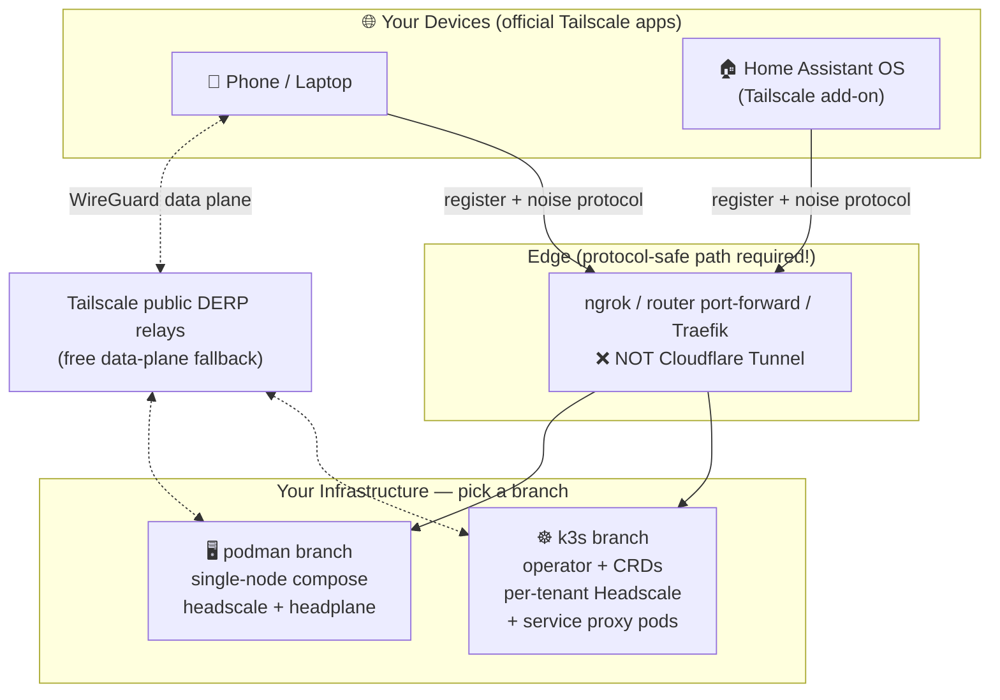

<h1 align="center">Woow VPN Headscale Package</h1>

<p align="center">
  <strong>Self-Hosted VPN Platform — Headscale + Headplane</strong><br/>
  Compatible with the official Tailscale client · K3s multi-tenant & single-node Podman editions
</p>

<p align="center">
  <a href="#what-is-this">What is this</a> &bull;
  <a href="#choose-your-deployment--branches">Branches</a> &bull;
  <a href="#architecture-at-a-glance">Architecture</a> &bull;
  <a href="#verified-results">Verified Results</a> &bull;
  <a href="#shared-documentation">Docs</a> &bull;
  <a href="README_zh-TW.md">中文文件</a>
</p>

<p align="center">
  
  
  
  
  
</p>

---

## What is this?

A production-tested blueprint for running your **own private VPN** — you host the control plane ([Headscale](https://github.com/juanfont/headscale), the open-source Tailscale coordination server) and the web admin UI ([Headplane](https://github.com/tale/headplane)), while every device connects with the **unmodified official Tailscale apps** (Android / iOS / Windows / macOS / Linux).

Everything in this repository was deployed and verified end-to-end on real infrastructure: a 10-node K3s cluster, a rootless-Podman host, a physical Android phone (Pixel 7a), a Home Assistant OS appliance, and in-cluster services (Nginx / Home Assistant / Odoo 18) reachable over the tailnet.

## Choose Your Deployment — Branches

This repository is organized by deployment target. **Pick a branch:**

| Branch | Target | Best for | Highlights |
|--------|--------|----------|-----------|
| [**`k3s`**](https://github.com/WOOWTECH/Woow_vpn_headscale_package/tree/k3s) | Kubernetes / K3s | Multi-tenant PaaS, production platform | headscale-operator CRDs, one Headscale per tenant, Tailscale proxy pods (`TS_DEST_IP`) to expose any K8s Service on the tailnet, Headplane per tenant |
| [**`podman`**](https://github.com/WOOWTECH/Woow_vpn_headscale_package/tree/podman) | Single node, rootless Podman | Home lab, edge box, cluster-outage fallback | `podman-compose` two-container stack, one-shot `deploy.sh` (keys + health checks fully automated), systemd boot persistence |
| **`main`** (you are here) | — | Overview & shared documentation | Branch guide, architecture summary, cross-cutting docs (external access analysis, HAOS add-on guide, deployment report) |

```bash
# Kubernetes / K3s edition
git clone -b k3s https://github.com/WOOWTECH/Woow_vpn_headscale_package.git

# Single-node Podman edition
git clone -b podman https://github.com/WOOWTECH/Woow_vpn_headscale_package.git
```

## Architecture at a Glance



**Key design facts** (details on each branch):

- **Control plane**: Headscale only coordinates keys/ACLs/routes — actual traffic is peer-to-peer WireGuard (with free Tailscale DERP relays as fallback).
- **⚠️ Cloudflare Tunnel cannot front Headscale** — it strips the Tailscale noise-protocol Upgrade header ([cloudflared#883](https://github.com/cloudflare/cloudflared/issues/883), [#990](https://github.com/cloudflare/cloudflared/issues/990)). ngrok, router port-forwarding, and standard reverse proxies (Traefik/Nginx/Caddy) are verified working. Full analysis: [`docs/EXTERNAL-ACCESS.md`](docs/EXTERNAL-ACCESS.md).
- **One service = one tailnet identity**: the k3s branch exposes K8s Services via independent Tailscale proxy pods rather than per-replica sidecars.

## Verified Results

| Scenario | Edition | Result |
|----------|---------|--------|
| Android phone (Pixel 7a) joins tailnet via ngrok | k3s | ✅ registered, reaches in-cluster services |
| HAOS appliance joins via Tailscale add-on | k3s | ✅ `100.64.0.7` online |
| Nginx / Home Assistant / Odoo exposed via proxy pods | k3s | ✅ reachable at tailnet IPs from phone |
| Full stack deploy on rootless Podman | podman | ✅ health pass, Headplane login |
| External node via public internet (ngrok TCP) | podman | ✅ registered + cross-node ping via DERP |

<p align="center">
  
  
</p>

## Shared Documentation

| Document | Content |
|----------|---------|
| [`docs/EXTERNAL-ACCESS.md`](docs/EXTERNAL-ACCESS.md) | Why Cloudflare Tunnel fails, tunnel compatibility matrix, verified exposure options |
| [`docs/HAOS-ADDON-SETUP.md`](docs/HAOS-ADDON-SETUP.md) | Connecting Home Assistant OS via the official Tailscale add-on |
| [`docs/DEPLOYMENT-REPORT.md`](docs/DEPLOYMENT-REPORT.md) | The complete deployment log — every issue hit and its fix |
| [`docs/screenshots/`](docs/screenshots) | UI screenshots from the live deployments |

## Components

| Component | Version | Role |
|-----------|---------|------|
| [Headscale](https://github.com/juanfont/headscale) | v0.29.2 | Self-hosted tailnet control plane |
| [Headplane](https://github.com/tale/headplane) | v0.7.0 | Web admin UI |
| [headscale-operator](https://github.com/infradohq/headscale-operator) | v0.6.0 | K8s CRDs (k3s branch) |
| [Tailscale](https://github.com/tailscale/tailscale) | latest | Official clients + proxy containers |

## License

Copyright © 2026 WoowTech (渥屋科技). All rights reserved.
