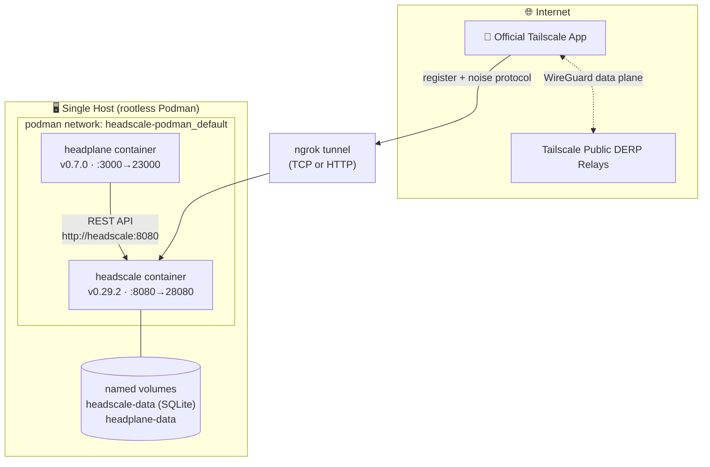

<h1 align="center">Woow VPN Headscale Package — Podman Edition</h1>

<p align="center">
  <strong>Single-Node Self-Hosted VPN — Headscale + Headplane on rootless Podman</strong><br/>
  No Kubernetes required · compatible with the official Tailscale client
</p>

<p align="center">
  <a href="#overview">Overview</a> &bull;
  <a href="#architecture">Architecture</a> &bull;
  <a href="#quick-start">Quick Start</a> &bull;
  <a href="#endpoints">Endpoints</a> &bull;
  <a href="#external-access">External Access</a> &bull;
  <a href="#gotchas">Gotchas</a> &bull;
  <a href="README_zh-TW.md">中文文件</a>
</p>

<p align="center">
  
  
  
  
</p>

> **Branch guide:** you are on the `podman` branch (single-node, no K8s).
> For the multi-tenant **Kubernetes/K3s** stack (operator + CRDs + proxy pods), switch to the [`k3s` branch](https://github.com/WOOWTECH/Woow_vpn_headscale_package/tree/k3s).
> The [`main` branch](https://github.com/WOOWTECH/Woow_vpn_headscale_package) holds the project overview.

---

## Overview

This branch runs the same verified Headscale v0.29.2 + Headplane v0.7.0 stack as the K3s edition, but on a single machine with **rootless Podman** + `podman-compose`. Ideal for home labs, edge boxes, or as a fallback control plane when the cluster is down.

Verified live on Podman 4.9.3 / podman-compose 1.0.6 (Ubuntu): health pass, Headplane login, and **two Tailscale nodes registered — one via the internal network, one via the public internet (ngrok) — pinging each other over WireGuard/DERP**.

## Architecture



## Repository Structure

```
podman branch/
├── podman-compose.yml        # headscale + headplane services
├── deploy.sh                 # one-shot automation
├── .env.example              # SERVER_URL template
├── config/
│   ├── headscale/config.yaml # v0.29.2 config (server_url patched by deploy.sh)
│   ├── headscale/policy.json # ACL + autoApprovers (file mode)
│   └── headplane/config.yaml # v0.7.0 config
└── docs/                     # shared docs + screenshots
```

## Quick Start

```bash
git clone -b podman https://github.com/WOOWTECH/Woow_vpn_headscale_package.git
cd Woow_vpn_headscale_package
cp .env.example .env          # optionally set SERVER_URL (ngrok URL / your domain)
./deploy.sh
```

`deploy.sh` automates everything:

1. Patches `server_url` from `.env` into the Headscale config
2. Generates the 32-char Headplane cookie secret
3. Starts Headscale → waits for `/health`
4. Creates the `default` user (idempotent)
5. Creates a 90-day Headscale API key → wires it into Headplane
6. Starts Headplane → verifies `/admin`
7. Creates a reusable 72 h PreAuthKey and prints the `tailscale up` command

## Endpoints

| Service | URL |
|---------|-----|
| Headscale control plane | `http://localhost:28080` (health: `/health`) |
| Headplane admin UI | `http://localhost:23000/admin` (login with printed API key) |
| Headscale metrics | `http://localhost:29090/metrics` |

<p align="center"></p>

## Connect a Device

```bash
tailscale up --login-server=<SERVER_URL> --authkey=<printed-preauth-key>
```

## External Access

> **Cloudflare Tunnel will NOT work** for VPN clients — it strips the Tailscale noise-protocol Upgrade header. See [`docs/EXTERNAL-ACCESS.md`](docs/EXTERNAL-ACCESS.md).

Verified ngrok path (free tier):

```bash
ngrok tcp 28080          # raw TCP passthrough — always protocol-safe
# or: ngrok http 28080   # also verified to pass the noise protocol
# then: SERVER_URL=<tunnel-url> in .env → ./deploy.sh
```

> Free-tier note: one static HTTPS domain per account. If it is already used by another tunnel, use `proto: tcp` for this stack (verified working — external node registered and pinged via DERP).

For production, front port 28080 with an upgrade-passing reverse proxy (Traefik / Nginx / Caddy) + TLS and a stable domain.

## Boot Persistence (optional)

```bash
podman generate systemd --new --files --name headscale headplane
mkdir -p ~/.config/systemd/user && mv container-*.service ~/.config/systemd/user/
systemctl --user daemon-reload
systemctl --user enable container-headscale container-headplane
loginctl enable-linger $USER
```

## Gotchas

All pre-fixed in these configs — documented for anyone adapting them:

| Issue | Fix baked in |
|-------|--------------|
| Headscale v0.29.2 removed `randomize_client_port` | Key omitted from `config.yaml` (fatal if present) |
| Policy-v2 file mode rejects `"*"` in `autoApprovers` | Uses `default@` username format in `policy.json` |
| Headplane secure-cookie warning breaks HTTP login | `cookie_secure: false` (set `true` behind HTTPS) |
| podman-compose 1.0.6 may not honor `x-podman: in_pod` | Headplane reaches Headscale via the network alias `http://headscale:8080` |
| Headplane v0.7.0 validates `integration.kubernetes.pod_name` even when disabled | No `integration:` section in config |
| `server_url` = `dns.base_domain` domain clash | `base_domain: ts.local` kept separate |

> Runtime-generated secrets (`config/headplane/cookie-secret`, `config/headplane/api-key`, `.env`) are git-ignored — never commit them.

## Verified Test Matrix

| Test | Result |
|------|--------|
| `curl :28080/health` | ✅ `{"status":"pass"}` |
| Headplane API-key login | ✅ machines dashboard |
| Internal node (compose network) | ✅ `100.64.0.2` registered |
| External node (public internet via ngrok TCP) | ✅ `100.64.0.1` registered |
| Cross-node `tailscale ping` (both directions) | ✅ `pong via DERP(hkg) ~128ms` |

## License

Copyright © 2026 WoowTech (渥屋科技). All rights reserved.
