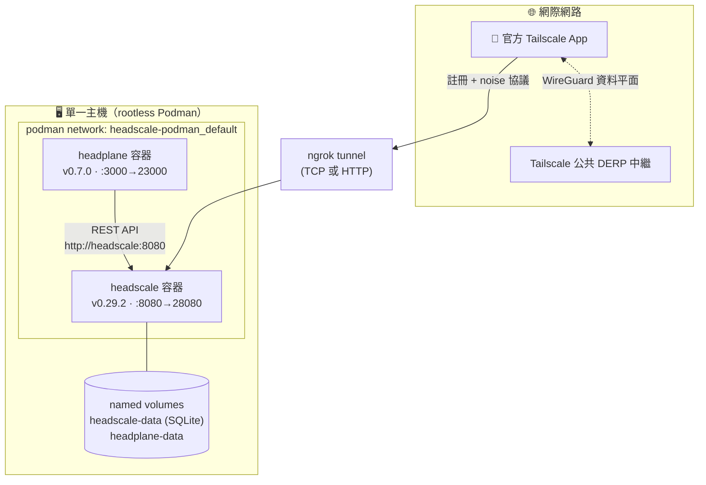

<h1 align="center">Woow VPN Headscale Package — Podman 版</h1>

<p align="center">
  <strong>單機自架 VPN — rootless Podman 上的 Headscale + Headplane</strong><br/>
  不需 Kubernetes · 相容官方 Tailscale 客戶端
</p>

<p align="center">
  <a href="#總覽">總覽</a> &bull;
  <a href="#架構">架構</a> &bull;
  <a href="#快速開始">快速開始</a> &bull;
  <a href="#端點">端點</a> &bull;
  <a href="#外部曝露">外部曝露</a> &bull;
  <a href="#地雷清單">地雷清單</a> &bull;
  <a href="README.md">English</a>
</p>

<p align="center">
  
  
  
  
</p>

> **分支導覽**：你在 `podman` 分支（單機、免 K8s）。
> 多租戶 **Kubernetes/K3s** 版（operator + CRD + proxy pods）請切換到 [`k3s` 分支](https://github.com/WOOWTECH/Woow_vpn_headscale_package/tree/k3s)。
> [`main` 分支](https://github.com/WOOWTECH/Woow_vpn_headscale_package)為專案總覽。

---

## 總覽

本分支在單一機器上用 **rootless Podman** + `podman-compose` 運行與 K3s 版相同且已驗證的 Headscale v0.29.2 + Headplane v0.7.0。適合 home lab、edge 裝置，或作為叢集故障時的備援控制平面。

已在 Podman 4.9.3 / podman-compose 1.0.6（Ubuntu）實測：health 通過、Headplane 登入成功、**兩個 Tailscale 節點註冊 — 一個走內部網路、一個經公網（ngrok）— 並透過 WireGuard/DERP 互 ping**。

## 架構



## 倉庫結構

```
podman branch/
├── podman-compose.yml        # headscale + headplane 服務
├── deploy.sh                 # 一鍵自動化
├── .env.example              # SERVER_URL 模板
├── config/
│   ├── headscale/config.yaml # v0.29.2 設定（deploy.sh 會替換 server_url）
│   ├── headscale/policy.json # ACL + autoApprovers（file mode）
│   └── headplane/config.yaml # v0.7.0 設定
└── docs/                     # 共用文件 + 截圖
```

## 快速開始

```bash
git clone -b podman https://github.com/WOOWTECH/Woow_vpn_headscale_package.git
cd Woow_vpn_headscale_package
cp .env.example .env          # 可選：設定 SERVER_URL（ngrok URL / 自有網域）
./deploy.sh
```

`deploy.sh` 全自動化：

1. 從 `.env` 把 `server_url` patch 進 Headscale 設定
2. 產生 32 字元 Headplane cookie secret
3. 啟動 Headscale → 等待 `/health` 通過
4. 建立 `default` 使用者（冪等）
5. 建立 90 天 Headscale API key → 自動接上 Headplane
6. 啟動 Headplane → 驗證 `/admin`
7. 產生 72 小時可重用 PreAuthKey 並印出 `tailscale up` 指令

## 端點

| 服務 | URL |
|------|-----|
| Headscale 控制平面 | `http://localhost:28080`（health: `/health`）|
| Headplane 管理介面 | `http://localhost:23000/admin`（用印出的 API key 登入）|
| Headscale metrics | `http://localhost:29090/metrics` |

<p align="center"></p>

## 裝置連線

```bash
tailscale up --login-server=<SERVER_URL> --authkey=<印出的-preauth-key>
```

## 外部曝露

> **Cloudflare Tunnel 對 VPN 客戶端無效** — 它會剝離 Tailscale noise 協議的 Upgrade header。詳見 [`docs/EXTERNAL-ACCESS.md`](docs/EXTERNAL-ACCESS.md)。

已驗證的 ngrok 路徑（免費方案）：

```bash
ngrok tcp 28080          # 原始 TCP 直通 — 協議絕對安全
# 或：ngrok http 28080   # 也已驗證可通過 noise 協議
# 然後：.env 設 SERVER_URL=<tunnel-url> → ./deploy.sh
```

> 免費版注意：每帳號一個 static HTTPS domain。若已被其他 tunnel 佔用，本堆疊改用 `proto: tcp`（已實測 — 外部節點成功註冊並經 DERP 互 ping）。

生產環境請在 28080 前面放支援 Upgrade 直通的反向代理（Traefik / Nginx / Caddy）+ TLS + 固定網域。

## 開機自啟（可選）

```bash
podman generate systemd --new --files --name headscale headplane
mkdir -p ~/.config/systemd/user && mv container-*.service ~/.config/systemd/user/
systemctl --user daemon-reload
systemctl --user enable container-headscale container-headplane
loginctl enable-linger $USER
```

## 地雷清單

以下問題已在這些設定檔中預先修正 — 供改編者參考：

| 問題 | 已內建的修正 |
|------|-------------|
| Headscale v0.29.2 移除 `randomize_client_port` | `config.yaml` 不含此 key（存在即 fatal）|
| Policy-v2 file mode 拒絕 autoApprovers 的 `"*"` | `policy.json` 用 `default@` username 格式 |
| Headplane secure-cookie 警告擋掉 HTTP 登入 | `cookie_secure: false`（上 HTTPS 後改 `true`）|
| podman-compose 1.0.6 可能忽略 `x-podman: in_pod` | Headplane 用 network alias `http://headscale:8080` 連線 |
| Headplane v0.7.0 即使停用也驗證 `integration.kubernetes.pod_name` | 設定檔不含 `integration:` 區段 |
| `server_url` 與 `dns.base_domain` 網域衝突 | `base_domain: ts.local` 分開 |

> Runtime 產生的 secrets（`config/headplane/cookie-secret`、`config/headplane/api-key`、`.env`）已被 git-ignore — 切勿提交。

## 已驗證測試矩陣

| 測試 | 結果 |
|------|------|
| `curl :28080/health` | ✅ `{"status":"pass"}` |
| Headplane API key 登入 | ✅ machines 儀表板 |
| 內部節點（compose network） | ✅ `100.64.0.2` 已註冊 |
| 外部節點（公網經 ngrok TCP） | ✅ `100.64.0.1` 已註冊 |
| 跨節點 `tailscale ping`（雙向） | ✅ `pong via DERP(hkg) ~128ms` |

## 授權

Copyright © 2026 WoowTech（渥屋科技）。保留所有權利。
