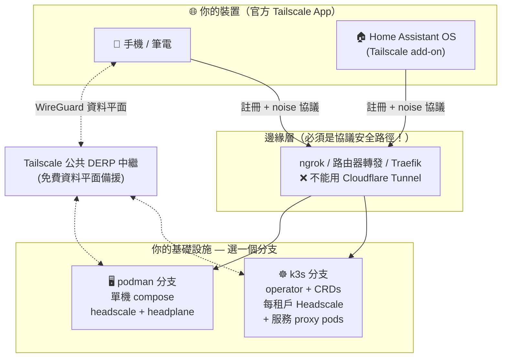

<h1 align="center">Woow VPN Headscale Package</h1>

<p align="center">
  <strong>自架 VPN 平台 — Headscale + Headplane</strong><br/>
  相容官方 Tailscale 客戶端 · K3s 多租戶版 & 單機 Podman 版
</p>

<p align="center">
  <a href="#這是什麼">這是什麼</a> &bull;
  <a href="#選擇部署方式--分支導覽">分支導覽</a> &bull;
  <a href="#架構總覽">架構</a> &bull;
  <a href="#已驗證成果">已驗證成果</a> &bull;
  <a href="#共用文件">文件</a> &bull;
  <a href="README.md">English</a>
</p>

<p align="center">
  
  
  
  
  
</p>

---

## 這是什麼？

一套經過生產環境實測的**自架私有 VPN** 藍圖 — 控制平面（[Headscale](https://github.com/juanfont/headscale)，Tailscale 協調伺服器的開源實作）與網頁管理介面（[Headplane](https://github.com/tale/headplane)）都由你自己託管，而所有裝置使用**未修改的官方 Tailscale App**（Android / iOS / Windows / macOS / Linux）連線。

本倉庫的所有內容都在真實基礎設施上完成端到端驗證：10 節點 K3s 叢集、rootless Podman 主機、實體 Android 手機（Pixel 7a）、Home Assistant OS 裝置，以及可透過 tailnet 存取的叢集內服務（Nginx / Home Assistant / Odoo 18）。

## 選擇部署方式 — 分支導覽

本倉庫依部署目標分支管理。**請選擇分支：**

| 分支 | 目標環境 | 適合場景 | 亮點 |
|------|---------|---------|------|
| [**`k3s`**](https://github.com/WOOWTECH/Woow_vpn_headscale_package/tree/k3s) | Kubernetes / K3s | 多租戶 PaaS、生產平台 | headscale-operator CRDs、一租戶一 Headscale、Tailscale proxy pods（`TS_DEST_IP`）把任意 K8s Service 曝露到 tailnet、每租戶 Headplane |
| [**`podman`**](https://github.com/WOOWTECH/Woow_vpn_headscale_package/tree/podman) | 單機 rootless Podman | Home lab、edge 裝置、叢集故障備援 | `podman-compose` 雙容器堆疊、一鍵 `deploy.sh`（金鑰 + 健康檢查全自動）、systemd 開機自啟 |
| **`main`**（目前所在） | — | 總覽與共用文件 | 分支導覽、架構摘要、跨版本文件（外部連線分析、HAOS add-on 指南、部署報告） |

```bash
# Kubernetes / K3s 版
git clone -b k3s https://github.com/WOOWTECH/Woow_vpn_headscale_package.git

# 單機 Podman 版
git clone -b podman https://github.com/WOOWTECH/Woow_vpn_headscale_package.git
```

## 架構總覽



**核心設計要點**（細節見各分支）：

- **控制平面**：Headscale 只負責金鑰/ACL/路由協調 — 實際流量走點對點 WireGuard（免費 Tailscale DERP 中繼作備援）。
- **⚠️ Cloudflare Tunnel 無法放在 Headscale 前面** — 它會剝離 Tailscale noise 協議的 Upgrade header（[cloudflared#883](https://github.com/cloudflare/cloudflared/issues/883)、[#990](https://github.com/cloudflare/cloudflared/issues/990)）。ngrok、路由器端口轉發、標準反向代理（Traefik/Nginx/Caddy）皆已驗證可行。完整分析：[`docs/EXTERNAL-ACCESS.md`](docs/EXTERNAL-ACCESS.md)。
- **一個服務 = 一個 tailnet 身分**：k3s 分支用獨立 Tailscale proxy pod 曝露 K8s Service，而非每副本 sidecar。

## 已驗證成果

| 場景 | 版本 | 結果 |
|------|------|------|
| Android 手機（Pixel 7a）經 ngrok 加入 tailnet | k3s | ✅ 註冊成功，可存取叢集內服務 |
| HAOS 裝置經 Tailscale add-on 加入 | k3s | ✅ `100.64.0.7` 在線 |
| Nginx / Home Assistant / Odoo 經 proxy pods 曝露 | k3s | ✅ 手機可用 tailnet IP 存取 |
| rootless Podman 全堆疊部署 | podman | ✅ health 通過、Headplane 登入 |
| 外部節點經公網（ngrok TCP）加入 | podman | ✅ 註冊成功 + 跨節點 DERP ping |

<p align="center">
  
  
</p>

## 共用文件

| 文件 | 內容 |
|------|------|
| [`docs/EXTERNAL-ACCESS.md`](docs/EXTERNAL-ACCESS.md) | Cloudflare Tunnel 失敗原因、tunnel 相容性矩陣、已驗證的曝露方案 |
| [`docs/HAOS-ADDON-SETUP.md`](docs/HAOS-ADDON-SETUP.md) | Home Assistant OS 經官方 Tailscale add-on 接入 |
| [`docs/DEPLOYMENT-REPORT.md`](docs/DEPLOYMENT-REPORT.md) | 完整部署紀錄 — 每個踩到的問題與解法 |
| [`docs/screenshots/`](docs/screenshots) | 真實部署的介面截圖 |

## 元件

| 元件 | 版本 | 角色 |
|------|------|------|
| [Headscale](https://github.com/juanfont/headscale) | v0.29.2 | 自架 tailnet 控制平面 |
| [Headplane](https://github.com/tale/headplane) | v0.7.0 | 網頁管理介面 |
| [headscale-operator](https://github.com/infradohq/headscale-operator) | v0.6.0 | K8s CRDs（k3s 分支）|
| [Tailscale](https://github.com/tailscale/tailscale) | latest | 官方客戶端 + proxy 容器 |

## 授權

Copyright © 2026 WoowTech（渥屋科技）。保留所有權利。
