<h1 align="center">Woow VPN Headscale Package</h1>

<p align="center">
  <strong>K3s / Kubernetes 自架多租戶 VPN 平台</strong><br/>
  Headscale + Headplane + Tailscale Proxy Pods — 相容官方 Tailscale 客戶端
</p>

<p align="center">
  <a href="#總覽">總覽</a> &bull;
  <a href="#架構">架構</a> &bull;
  <a href="#安裝">安裝</a> &bull;
  <a href="#元件">元件</a> &bull;
  <a href="#截圖">截圖</a> &bull;
  <a href="#外部連線">外部連線</a> &bull;
  <a href="#疑難排解">疑難排解</a> &bull;
  <a href="README.md">English</a>
</p>

<p align="center">
  
  
  
  
  
</p>

---

## 總覽

**Woow VPN Headscale Package** 是在 K3s/Kubernetes 上運行**自架多租戶 VPN 平台**的生產級部署藍圖。每個租戶擁有一套獨立的 [Headscale](https://github.com/juanfont/headscale) 控制平面（Tailscale 協調伺服器的開源實作）、一套 [Headplane](https://github.com/tale/headplane) 網頁管理介面，並可透過輕量的 **Tailscale proxy pod** 將叢集內任何 Kubernetes Service 接入租戶私有網路（tailnet）。

終端裝置使用**未修改的官方 Tailscale App**（Android / iOS / Windows / macOS / Linux）連線 — 不需要客製客戶端。

本倉庫在真實的 10 節點 K3s 叢集上完成端到端驗證，包含實體 Android 手機（Pixel 7a）、Home Assistant OS 裝置，以及三個叢集內服務（Nginx、Home Assistant 容器、Odoo 18）。

### 為什麼選這個套件？

| 挑戰 | 解法 |
|------|------|
| SaaS VPN（Tailscale/ZeroTier）的協調平面在別人的雲端 | 自架 Headscale — 控制平面與資料完全自主 |
| 所有客戶共用同一個 tailnet 有資安風險 | **一租戶一 Headscale 實例** — 硬隔離，無共用 ACL 檔 |
| 手動管理 Headscale（CLI、config 檔）無法規模化 | 透過 [headscale-operator](https://github.com/infradohq/headscale-operator) 宣告式 CRD：`Headscale`、`HeadscaleUser`、`HeadscalePreAuthKey`、`HeadscaleAutoApprover` |
| K8s 服務接入 VPN 通常要每個 Pod 塞 sidecar | 每服務一個獨立 **tailscale proxy pod** — 一個服務 = 一個穩定 tailnet 身分，避免多副本身分混亂 |
| Headscale 沒有內建網頁介面 | Headplane v0.7 — 瀏覽器管理機器、使用者、ACL |
| Cloudflare Tunnel 會無聲地弄壞 Tailscale 客戶端 | 完整記錄根本原因 + 驗證可行的替代方案（見[外部連線](#外部連線)） |

---

## 架構

### 系統總覽

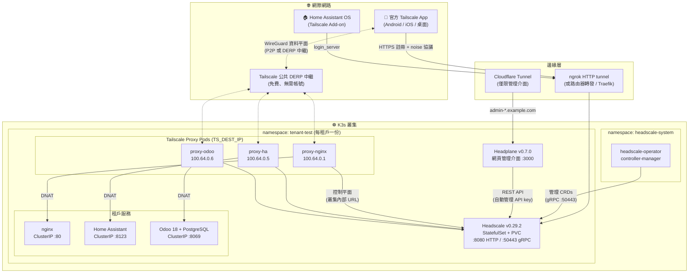

### 租戶開通流程（Operator CRDs）

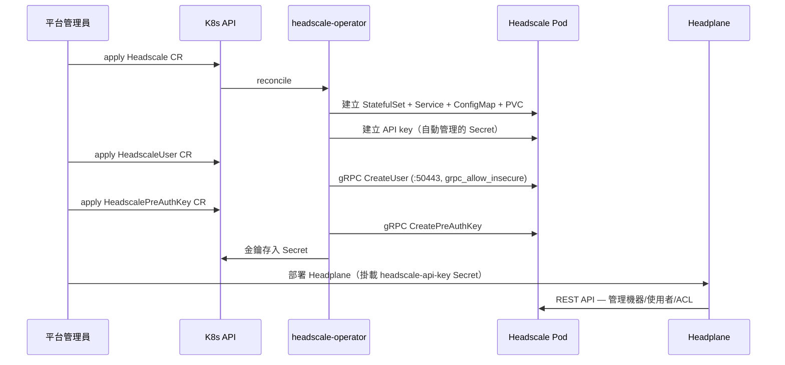

### 服務接入 VPN 模式（Proxy Pod）

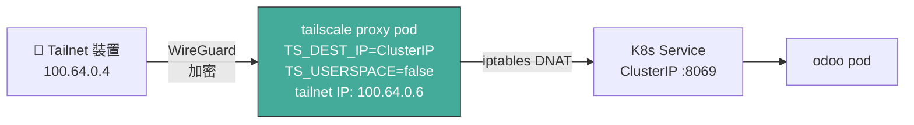

> **為什麼用獨立 proxy pod 而不是 sidecar？** 服務水平擴展成 N 個副本時，每個副本裡的 Tailscale sidecar 會在 tailnet 註冊 N 個不同身分。一個獨立 proxy pod 指向 Service ClusterIP，維持「**一個服務 = 一個穩定 tailnet 身分**」，副本間的負載均衡交給 K8s Service 處理。這也對齊 Cloudflare 官方對 `cloudflared` 部署的建議模式。

---

## 倉庫結構

```
Woow_vpn_headscale_package/
├── README.md                     # 英文文件
├── README_zh-TW.md               # 本文件
├── manifests/
│   ├── tenant/                   # 每租戶核心堆疊
│   │   ├── 01-namespace.yaml         # 租戶 namespace
│   │   ├── 02-headscale-cr.yaml      # Headscale CRD（v0.29.2、ACL、autoApprovers）
│   │   ├── 03-headscale-user.yaml    # 預設使用者
│   │   ├── 05-headplane-secret.yaml  # Cookie secret（模板）
│   │   ├── 06-headplane-configmap.yaml
│   │   ├── 07-headplane-deployment.yaml
│   │   ├── 08-cloudflared-config-patch.yaml  # CF Tunnel 路由（僅管理介面）
│   │   ├── 09-preauth-key.yaml       # 裝置 PreAuthKey CRD
│   │   └── 10-auto-approver.yaml     # 路由自動核准說明
│   ├── services/                  # 示範工作負載
│   │   ├── 11-test-nginx.yaml
│   │   ├── 20-ha-deploy.yaml         # Home Assistant 容器
│   │   └── 21-odoo-deploy.yaml       # Odoo 18 + PostgreSQL 16
│   └── vpn-proxy/                 # 服務接入 VPN 的 proxy pods
│       ├── 12-proxy-preauth-key.yaml
│       ├── 13-tailscale-proxy.yaml   # RBAC + proxy Deployment（nginx 範例）
│       └── 22-vpn-proxy-ha-odoo.yaml # HA + Odoo proxies
├── scripts/
│   ├── deploy.sh                  # Phase 1-4 一鍵部署（K8s）
│   └── add-service-to-vpn.sh      # 把任意 Service 加入 tailnet
└── docs/
    ├── DEPLOYMENT-REPORT.md       # 完整部署紀錄（所有問題 + 解法）
    ├── EXTERNAL-ACCESS.md         # 外部連線方案深度分析
    ├── HAOS-ADDON-SETUP.md        # Home Assistant OS Tailscale Add-on 指南
    └── screenshots/               # 介面截圖
```

---

## 安裝

### 前置需求

- K3s / Kubernetes ≥ 1.25，且有預設 StorageClass
- Helm ≥ 3.8（支援 OCI registry）
- cluster-admin 權限的 `kubectl`

### 快速開始

```bash
git clone -b k3s https://github.com/WOOWTECH/Woow_vpn_headscale_package.git
cd Woow_vpn_headscale_package
./scripts/deploy.sh
```

> 需要單機 **Podman** 版（免 K8s）？請切換到 [`podman` 分支](https://github.com/WOOWTECH/Woow_vpn_headscale_package/tree/podman)。

### 手動步驟

**Phase 1 — Operator**

```bash
kubectl create ns headscale-system
helm install headscale-operator \
  oci://ghcr.io/infradohq/headscale-operator/charts/headscale-operator \
  --version 0.5.0 -n headscale-system
# ⚠️ Chart 版本 0.5.0 = app v0.6.0（chart 與 app 版本不同！）

kubectl get crd | grep headscale
# headscales / headscaleusers / headscalepreauthkeys / headscaleautoapprovers
```

**Phase 2 — 租戶 Headscale**

編輯 `manifests/tenant/02-headscale-cr.yaml`（設定你的 `server_url` 與 storage class），然後：

```bash
kubectl apply -f manifests/tenant/01-namespace.yaml
kubectl apply -f manifests/tenant/02-headscale-cr.yaml
kubectl apply -f manifests/tenant/03-headscale-user.yaml
```

**Phase 3 — Headplane UI**

```bash
kubectl create secret generic headplane-secrets \
  --from-literal=COOKIE_SECRET="$(openssl rand -hex 16)" -n tenant-test
kubectl apply -f manifests/tenant/06-headplane-configmap.yaml
kubectl apply -f manifests/tenant/07-headplane-deployment.yaml
```

用自動管理的 API key 登入 Headplane：

```bash
kubectl get secret headscale-api-key -n tenant-test -o jsonpath='{.data.api-key}' | base64 -d
```

**Phase 4 — 裝置連線**

```bash
kubectl apply -f manifests/tenant/09-preauth-key.yaml
KEY=$(kubectl get secret test-device-preauth-key -n tenant-test -o jsonpath='{.data.key}' | base64 -d)
# 在裝置上執行：
tailscale up --login-server=https://<你的-headscale-網址> --authkey=$KEY
```

**Phase 5 — 服務接入 VPN**

```bash
./scripts/add-service-to-vpn.sh <service名稱> <namespace> [tailnet主機名]
# 範例：
./scripts/add-service-to-vpn.sh odoo tenant-test odoo
```

---

## 元件

| 元件 | 版本 | Image / Chart | 角色 |
|------|------|---------------|------|
| headscale-operator | v0.6.0（chart 0.5.0） | `oci://ghcr.io/infradohq/headscale-operator/charts/headscale-operator` | 用 CRD 宣告式管理 Headscale 實例生命週期 |
| Headscale | v0.29.2 | `headscale/headscale:v0.29.2` | 每租戶 tailnet 控制平面（金鑰交換、ACL、節點註冊） |
| Headplane | v0.7.0 | `ghcr.io/tale/headplane:0.7.0` | 網頁管理介面（機器/使用者/ACL） |
| Tailscale proxy | latest | `tailscale/tailscale:latest` | `TS_DEST_IP` DNAT 代理，把 K8s Service 曝露到 tailnet |
| DERP | — | Tailscale 公共中繼 | NAT 穿透失敗時的資料平面備援（免費、無需帳號） |

### 已驗證的 Tailnet（真實部署）

| 節點 | Tailnet IP | 類型 | 狀態 |
|------|-----------|------|------|
| nginx-test | 100.64.0.1 | Proxy pod → nginx | ✅ 在線 |
| Pixel 7a | 100.64.0.4 | 官方 Android app | ✅ 已註冊 |
| homeassistant | 100.64.0.5 | Proxy pod → HA 容器 | ✅ 在線 |
| odoo | 100.64.0.6 | Proxy pod → Odoo 18 | ✅ 在線 |
| woowtechshowha | 100.64.0.7 | HAOS Tailscale add-on | ✅ 在線 |

---

## 截圖

### Headplane — 機器總覽
所有 tailnet 節點（proxy pods、手機、HAOS 裝置）在同一個儀表板：

<p align="center">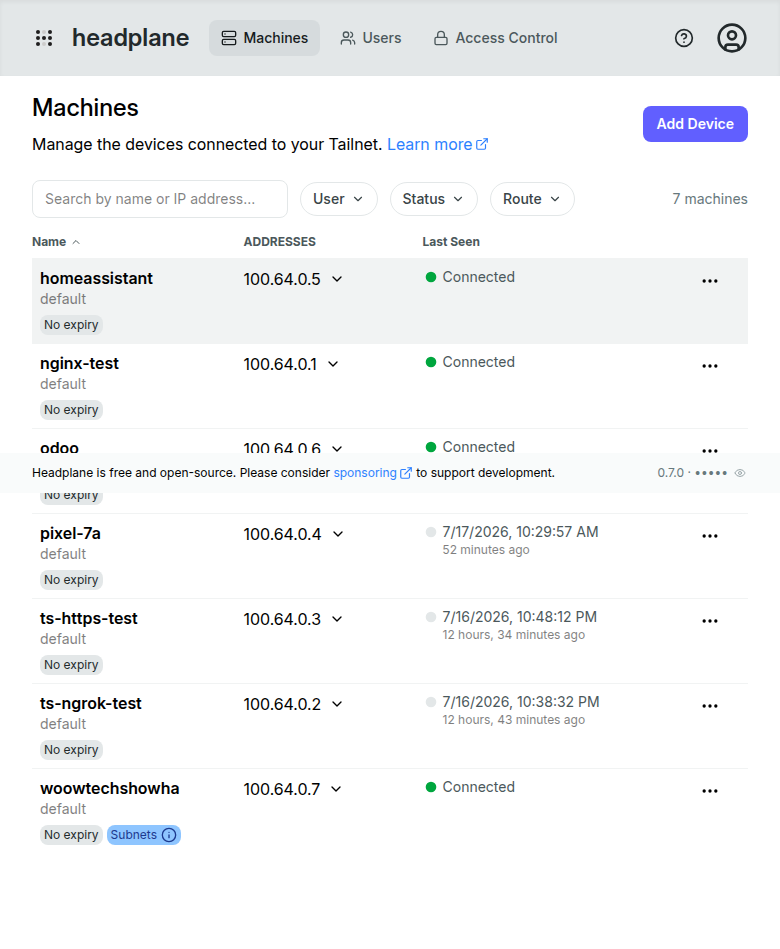</p>

### Headplane — 機器詳細頁
單一節點的 tailnet IP、連線狀態、路由管理：

<p align="center">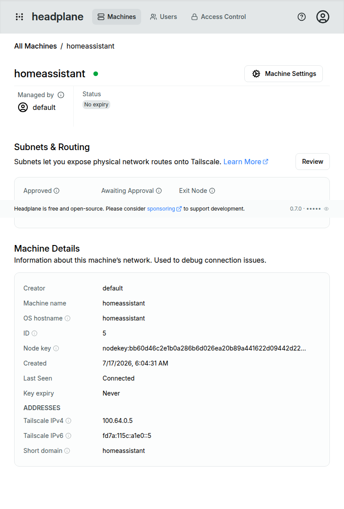</p>

### Headplane — API Key 登入
Headplane 用 operator 自動管理的 API key 對 Headscale 認證：

<p align="center">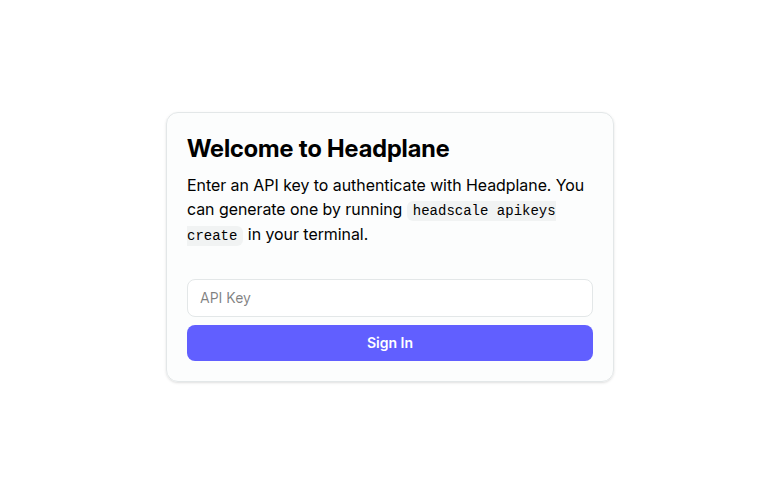</p>

### Headplane — 使用者管理
租戶使用者管理：

<p align="center">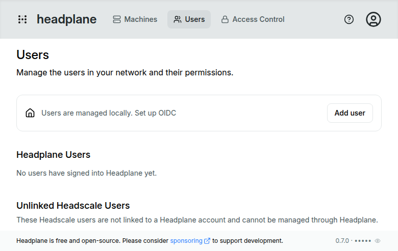</p>

### Headscale 控制平面 — 健康檢查
`https://vpn-<租戶>.example.com/health` 透過 tunnel 正常回應：

<p align="center">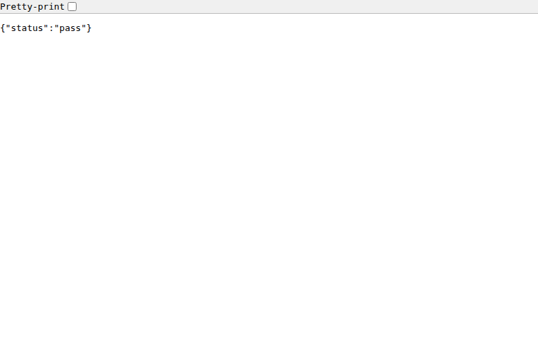</p>

### Android — 自訂協調伺服器
官方 Tailscale app 指向自架 Headscale：

<p align="center">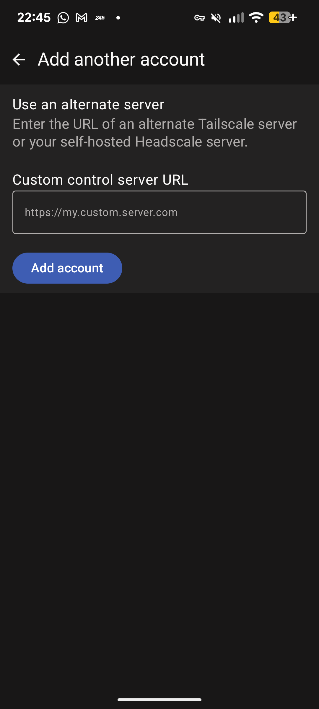</p>

### 透過 VPN 存取服務

手機透過 tailnet 開啟 `http://100.64.0.5:8123`（Home Assistant 初始設定）與 `http://100.64.0.6:8069`（Odoo 資料庫管理）：

<p align="center">
  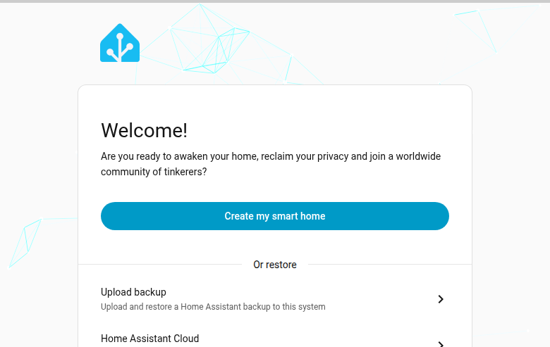
  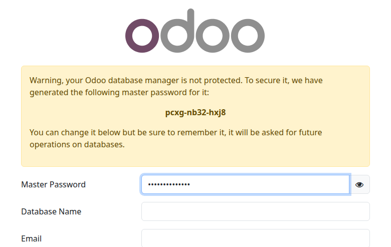
</p>

---

## 外部連線

> **⚠️ 關鍵發現：Cloudflare Tunnel 無法代理 Headscale 客戶端流量。**
> Tailscale 控制協議用 **POST** 請求 + 非標準 `Upgrade: tailscale-control-protocol` header 升級 HTTP 連線。Cloudflare 兩者都會剝離（[cloudflared#883](https://github.com/cloudflare/cloudflared/issues/883)、[cloudflared#990](https://github.com/cloudflare/cloudflared/issues/990)），且 [Headscale 官方文件](https://headscale.net/stable/ref/integration/reverse-proxy/)明確聲明無法運作。Headplane **管理介面**走 Cloudflare 沒問題 — 只有 VPN 控制平面受影響。

已驗證的可行方案（依推薦順序）：

| 方案 | 成本 | 穩定性 | 說明 |
|------|------|--------|------|
| **路由器端口轉發 + Traefik + Let's Encrypt** | 免費 | ⭐⭐⭐⭐⭐ | 生產環境首選。Cloudflare DNS 設 DNS-only（灰雲） |
| **ngrok HTTP tunnel** | 免費方案 | ⭐⭐⭐ | ✅ **實測可行** — ngrok 會完整通過 noise 協議。免費版重啟換網址、1 GB/月 |
| **ngrok TCP tunnel** | 免費方案 | ⭐⭐⭐ | ✅ 實測 — 原始 TCP 直通，但隨機 host/port 無法配合法 TLS 憑證 |
| Pinggy / bore.pub | $0–3/月 | ⭐⭐ | 原始 TCP 替代方案，同樣有憑證問題 |
| Cloudflare Tunnel | — | ❌ | **VPN 客戶端無法使用**（僅限管理介面） |

完整分析與設定指南見 [`docs/EXTERNAL-ACCESS.md`](docs/EXTERNAL-ACCESS.md)。

---

## 設定重點

### Headscale CR 要點（`manifests/tenant/02-headscale-cr.yaml`）

```yaml
spec:
  version: "v0.29.2"
  config:
    server_url: "https://vpn-test.example.com"   # 客戶端撥入的公開 URL
    grpc_listen_addr: "0.0.0.0:50443"
    grpc_allow_insecure: true      # operator 必需（叢集內 gRPC）
    dns:
      magic_dns: true
      base_domain: "ts.example.com"  # 必須與 server_url 網域不同！
    policy:
      mode: database               # 啟用 API 推送 ACL policy
  acl_policy:
    inline: |                      # autoApprovers 寫這裡（CRD 與 v0.29 不相容）
      {
        "acls": [{"action": "accept", "src": ["*"], "dst": ["*:*"]}],
        "autoApprovers": {
          "routes": {"10.0.0.0/8": ["*"], "192.168.0.0/16": ["*"]},
          "exitNode": ["*"]
        }
      }
```

### Tailscale proxy pod 要點

```yaml
env:
  - name: TS_DEST_IP           # 目標 Service 的 ClusterIP
    value: "10.43.x.x"
  - name: TS_USERSPACE          # 必須是 "false" — userspace 模式不支援 TS_DEST_IP
    value: "false"
  - name: TS_EXTRA_ARGS         # 用叢集內部 URL，繞過所有外部 proxy 問題
    value: "--login-server=http://headscale.tenant-test.svc.cluster.local:8080"
# 必需：NET_ADMIN capability、/dev/net/tun hostPath、
#       ServiceAccount 需要 secrets 的 get/create/update/patch 權限
```

---

## 疑難排解

真實部署過程中遇到的每個問題、根本原因與解法：

| 症狀 | 根本原因 | 解法 |
|------|---------|------|
| Headscale 崩潰：`server_url cannot use the same domain as base_domain` | MagicDNS 網域衝突 | `dns.base_domain` 改用不同網域 |
| Operator：`connection refused :50443` | Headscale v0.29 預設不啟動 gRPC | `grpc_allow_insecure: true` + `grpc_listen_addr` |
| CRD apply 失敗：`unknown field "spec.apiKey"` | Operator CRD 用 **snake_case** | `api_key`、`persistent_volume_claim`、`auto_manage` 等 |
| Headplane 崩潰：`integration.kubernetes.pod_name must be a string` | v0.7.0 即使 `enabled: false` 也會驗證 | 移除整個 `integration:` 區段 |
| AutoApprover CRD：`invalid owner format` | CRD tag_owners 與 Headscale v0.29 policy-v2 解析器不相容 | 改在 `acl_policy.inline` 定義 `autoApprovers` |
| Proxy pod：`TS_DEST_IP is not supported with TS_USERSPACE` | 容器預設 userspace 模式 | 明確設定 `TS_USERSPACE: "false"` |
| Proxy pod 的 secrets RBAC 錯誤 | K8s 模式把狀態存在 Secret | ServiceAccount + Role（secrets 的 get/create/update/patch） |
| 客戶端透過 Cloudflare 註冊回 `500` | CF 剝離 `Upgrade: tailscale-control-protocol` | Headscale 不要放 Cloudflare 後面 — 見[外部連線](#外部連線) |
| HAOS add-on：`can't change --login-server without --force-reauth` | 之前連過其他控制伺服器的殘留狀態 | 解除安裝 + 重裝 add-on（清除狀態），再設 `login_server` |
| 叢集內 DNS 對新記錄回 NXDOMAIN | CoreDNS 負面快取（SOA min TTL 1800 秒） | CoreDNS custom forward zone 直連 1.1.1.1，或等 30 分鐘 |

完整過程紀錄見 [`docs/DEPLOYMENT-REPORT.md`](docs/DEPLOYMENT-REPORT.md)。

---

## 安全性說明

- 每個租戶都有**專屬 Headscale 實例** — 租戶之間不共用 ACL 或金鑰材料。
- Headscale API key 由 operator **自動輪替**（90 天到期、80 天輪替緩衝）。
- Proxy pod 的 PreAuthKey 為 **ephemeral + 單次使用** — Pod 刪除後節點自動從 tailnet 消失。
- 資料平面為端到端 **WireGuard** 加密；DERP 中繼只轉發已加密的封包。
- 切勿提交真實的 cookie secret、API key 或 PreAuthKey — 本倉庫的 manifest 都使用佔位符。

---

## 未來規劃

- [ ] Litestream sidecar：SQLite → S3/MinIO 持續備份
- [ ] OIDC 整合（Headplane ↔ 平台 SSO）
- [ ] Helm chart 一鍵租戶開通
- [ ] 自架 DERP 中繼作為區域選項
- [ ] Traefik IngressRoute + cert-manager（DNS-01）免 tunnel 曝露 manifest

---

## 授權

Copyright © 2026 WoowTech（渥屋科技）。保留所有權利。

## 致謝

基於這些優秀的開源專案：[juanfont/headscale](https://github.com/juanfont/headscale) · [tale/headplane](https://github.com/tale/headplane) · [infradohq/headscale-operator](https://github.com/infradohq/headscale-operator) · [tailscale/tailscale](https://github.com/tailscale/tailscale)
